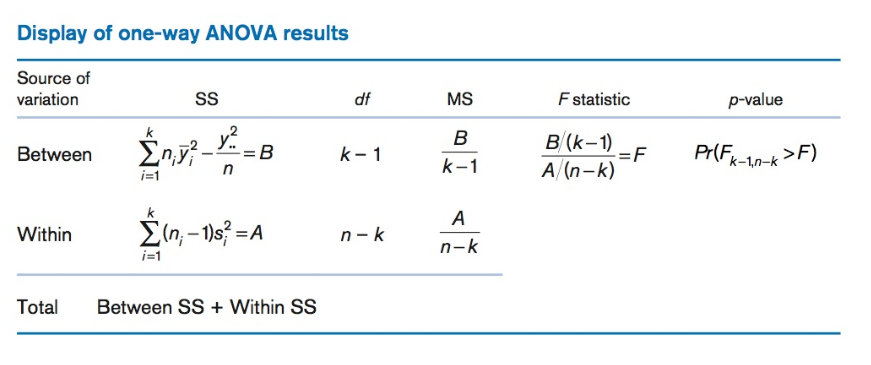

```{r setup, include=FALSE}
knitr::opts_chunk$set(echo = TRUE)
```

# Taller R Avanzado: Regresión Múltiple, ANOVA, GLM

#### Lista de paquetes a instalar

* readxl
* car
* EnvStats
* tidyverse
* coefplot
* leaps
* rmarkdown
* ggplot2
* MASS
* multcomp
* effects
* gplots
* agricolae
* plyr
* caret


#### Lista de archivos a usar
Los siguientes archivos deben estar disponible en su directorio de trabajo de R:

* [mod_empiricos.xlsx](https://drive.google.com/open?id=1kKD0vOoQCBjgoecqvdcdwFiJuiEyaz-U)  
* [strain_sex_chol.xlsx](https://drive.google.com/open?id=1ATmAlI0I6K9m2GG0uukhH_72zQkTJQps)
* [Titanic.xlsx](https://drive.google.com/open?id=1scOVpqtb6c9EbM90m0pZm3zg98Khde_o)

### Objetivos Generales

* Conocer y aplicar los métodos disponibles en R para obtener los parámetros de __modelos de regresión múltiple__, evaluar su idoneidad para describir los datos, e interpretar su significado.

* Aplicar funciones de R para diseños de investigación apropiados para el __análisis de varianza__.

* Conocer y aplicar funciones de R para extender los modelos lineales a situaciones en las que la variable dependiente no tiene distribución normal __(GLM)__.

__DIA 1__

# Regresión Lineal Múltiple
Cuando tenemos más de una variable predictora ("independiente"), la regresión lineal simple viene a ser una __regresión múltiple__.

$$Y_j=\alpha+\beta_1X_{1j}+\beta_2X_{2j}+...+\beta_nX_{nj}$$


#### Ejemplo 1 y Datos

Usaremos como ejemplo los datos _bmi_ en el archivo _mod_empiricos.xlsx_.  Estos son datos de individuos adultos entre 21 y 79 años, con las siguientes variables: _BMI_, índice de masa corporal ($kg/m^{2}$); _Age_, edad (_años_); _Cholesterol_, niveles de colesterol en sangre, ($mg/dL$); _Glucose_, niveles de glucosa en la sangre, ($mg/dL$).

Para leer los datos emplearemos el siguiente código (obtenido del menú _Import Dataset/From Excel_):

```{r}
library(readxl)
reg.multiple <- read_excel("mod_empiricos.xlsx", 
                            sheet = "bmi")
# para ver las primeras seis filas de datos
head(reg.multiple)
```

### Pruebas de supuestos para regresión paramétrica usando el método de mínimos cuadrados (_OLS, ordinary least square_)

* __Normalidad__: Gráficamente: Q-Q plot; Estadísticamente: prueba de Shapiro & Wilk
* __Independencia__: los valores de $Y_j$ son independientes entre si, lo asumimos (no hay autocorrelación).
* __Linealidad__: relación lineal entre variable dependiente y cada una de las independientes; gráficas individuales.  Puede arreglarse con transformación; prueba de Box Tidwell.
* __Homocedasticidad__: varianza de la variable dependiente (residuales) no varía con los valores de las variables independientes; gráfica de los residuales.
* __Multicolinealidad__: las variables independientes no deben estar correlacionadas entre si.

#### Normalidad

* Evaluación gráfica de normalidad de la variable dependiente. 
```{r qqplot, message=FALSE}
library(EnvStats)
qqPlot(reg.multiple$BMI, add.line = TRUE, points.col = "blue", line.col = "red")
```

* Prueba estadística de normalidad Shapiro & Wilk ($H_0:distribución\enspace normal$)
```{r shapiroW}
shapiro.test(reg.multiple$BMI)
```

#### Autocorrelación
La prueba de Durbin-Watson nos permite evaluar si ocurre autocorrelación entre los valores residuales de la variable dependiente.  Por ejemplo, una variable que depende del tiempo, presenta autocorrelación.  La $H_0$ es que la autocorrelación en los residuales del modelo es 0.

* Prueba de Durbin-Watson para autocorrelación
```{r message=FALSE}
library(car)
model <- lm(BMI ~ Age + Cholesterol + Glucose, data = reg.multiple)
dbt <- durbinWatsonTest(model, simulate = TRUE)
dbt
```

#### Linealidad

* Prueba de Box Tidwell para linealidad
```{r}
library(car)
boxTidwell(BMI ~ Age + Cholesterol + Glucose, data = reg.multiple)
```


#### Multicolinealidad

* Matriz de correlación y gráficas de puntos con líneas de regresión

```{r}
library(car)
#matriz de correlación
cor(reg.multiple)
#gráfica de regresiones en parejas, con línea de regresión
scatterplotMatrix(reg.multiple, ~ BMI + Age + Cholesterol + Glucose,
                  smooth = list(lty = 2), id = TRUE,
                  regLine = list(lty = 1, col = "red"),
                  col = "blue")
```

### Modelos de regresión lineal múltiple
A continuación se calculan los parámetros de diversos modelos de regresión, y se incluye una prueba de homocedasticidad (homogeneidad de la varianza) para cada modelo.

#### Modelo completo (todas las variables)

```{r}
modRM <- lm(BMI ~ Age + Cholesterol + Glucose, 
              data = reg.multiple)
summary(modRM)
aic <- AIC(modRM)
sprintf("AIC = %.2f", aic)
# prueba de homocedasticidad (Non-constant Variance Score Test)
# Ho:la varianza es constante en el ámbito de la predicción de Y
ncvTest(modRM)
spreadLevelPlot(modRM)
```

#### Modelo eliminando la variable Age, por ser la menos correlaciona con BMI, y tener la mayor correlación con Glucose

```{r}
modRM <- lm(BMI ~ Cholesterol + Glucose, 
              data = reg.multiple)
summary(modRM)
aic <- AIC(modRM)
sprintf("AIC = %.2f", aic)
# prueba de homocedasticidad
ncvTest(modRM)
spreadLevelPlot(modRM)
```

#### Modelo con interacción entre Age y Glucose
Para denotar interacción entre variables se usa el símbolo __( : )__   Para incluir las variables solas y su interacción se utiliza el símbolo __( * )__

```{r}
modRM <- lm(BMI ~ Cholesterol + Glucose:Age, 
              data = reg.multiple)
summary(modRM)
aic <- AIC(modRM)
sprintf("AIC = %.2f", aic)
# prueba de homocedasticidad
ncvTest(modRM)
spreadLevelPlot(modRM)
```

### Selección automática de modelo - método "stepwise"
Existen métodos para seleccionar automáticamente el mejor modelo, a base de estadísticos indicadores, y que conlleva un procedimiento iterativo.  Uno de estos procedimientos es conocido como 'stepwise' (por pasos), y aunque no es el más aceptado en la actualidad, ha sido muy usado y es una buena manera de ilustrar el procedimiento, usando nuestros datos.

En este procedimiento el proceso de selección se basa en mantener el modelo con el menor valor del estadístico __AIC__ (Akaike Information Criterion), que indica el modelo con la menor pérdida de información y mayor simplicidad.  En el proceso se parte de un modelo nulo (no efecto de predictores) y hasta un modelo muy complejo, incluyendo interacciones.  Las variables se incluyen y se quitan, y cada vez se recalcula AIC, hasta obtener el modelo que mantiene el mínimo valor de AIC.

```{r}
#formulación de un modelo nulo y un modelo completo
modNulo <- lm(BMI ~ 1, data = reg.multiple)
modFull <- lm(BMI ~ Cholesterol*Glucose + Age*Cholesterol + Age*Glucose, 
              data = reg.multiple)
#procedimiento stepwise
bmistep <- step(modNulo,
                scope = list(lower=modNulo, upper=modFull,
                             direction="both"))

summary(bmistep)
```

### Comparación de modelos   

#### Gráfica de coeficientes
Una manera de comparar visualmente modelos (en realidad sus coeficientes) es usar el paquete __coefplot__, en conjunto con __ggplot2__, para crear una gráfica de los coeficientes estimados de cada variable (sola o de interacción), en cada modelo y detectar los que son diferentes de 0, y los modelos que los contienen.

```{r}
library(ggplot2)
library(coefplot)
#cálculo para todos los modelos
modbmi1 <- lm(BMI ~ Age + Cholesterol + Glucose, data=reg.multiple)
modbmi2 <- lm(BMI ~ Age*Glucose + Cholesterol*Glucose + Age*Cholesterol, data=reg.multiple)
modbmi3 <- lm(BMI ~ Cholesterol + Age:Glucose, data=reg.multiple)
modbmi4 <- lm(BMI ~ Cholesterol + Glucose, data=reg.multiple)
modbmi5 <- lm(BMI ~ Cholesterol, data = reg.multiple)
#comparando coeficientes de todos los modelos
multiplot(modbmi1, modbmi2, modbmi3, modbmi4, modbmi5, pointSize = 2, intercept=FALSE)
```

#### Selección de modelo usando R-cuadrado ajustado y Mallow's Cp para mejores modelos

El estadístico $R^2$ es la cantidad de varianza en la respuesta (variable dependiente) producido por las variables predictoras, mediante el modelo, por lo tanto constituye una buena manera de medir la capacidad del modelo para "explicar" los datos.  Sin embargo, en un modelo de regresión múltiple, el $R^2$ aumenta al aumentar el número de predictores, lo cual conlleva a sobrestimar la "calidad" del modelo, con un número excesivo de variables.  Usando el $R^2ajustado$ se toma en cuenta el número de parámetros en el modelo, por lo tanto es una medida más realista del ajuste al modelo.

El estadístico de Mallow, $C_p$, es otro indicador para seleccionar el mejor modelo en una regresión múltiple; funciona de manera similar al AIC, y sirve para evitar incluir parámetros en exceso en el modelo.  La regla general es escoger el modelo con el número de parámetros, en el cual el valor de $C_p$ sea cercano (pero menor) al número de parámetros más 1.

```{r, fig.width=7, fig.height=7}
library(leaps)
modSS <- regsubsets(BMI ~ Age*Cholesterol + Cholesterol*Glucose + Age*Glucose, data = reg.multiple, nbest = 3, intercept = TRUE)
# gráfica para R^2 ajustado
plot(modSS, scale="adjr2")
# gráfica para Cp
plot(modSS, scale="Cp")
# otra forma de visualizar Cp
library(car)
## Mallow Cp
mallowCp <-
    subsets(modSS, statistic="cp", legend = FALSE, min.size = 1, main = "Mallow Cp")
abline(a = 1, b = 1, lty = 2)
```

### EJERCICIO 

Usar los datos [deathsmall_cities.xlsx](https://drive.google.com/open?id=1Q5rkNpatiTDg90ieVbwAw_fziIQNA4eJ) para buscar un modelo de regresión múltiple entre la variable dependiente _death1K_ (muertes anuales por cada 1000 habitantes) y las otras variables del archivo.

=================================

***
__DIA 2__

# ANOVA

Cuando necesitamos comparar las medias de más de dos muestras, la metodología estadística utilizada comúnmente para estos casos, es el __análisis de varianza__.

## Modelo de Una-Vía (One-Way) 
Tenemos el siguiente modelo para describir el valor de cualquier observación, proveniente de varios grupos ($n_i, i=1...k$), cada uno con $n_{ij}$ observaciones:

$$y_{ij} = \mu + \alpha_i + e_{ij}$$
donde:

> (1) $\mu$ representa la media de todas las mediciones de todos los grupos.
> (2) $\alpha_i$ representa la diferencia entre la media del grupo $n_i$ y la media de todos los grupos.
> (3) $e_{ij}$ representa el error aleatorio alrededor de los valores $\mu + \alpha_i$, de una observación del grupo $n_i$.

La hipótesis nula para el análisis de varianza de una vía, sería que las medias de los grupos son las mismas (e iguales a la media global, $\mu$), para esto todos los valores de $\alpha_i$ deben ser igual a 0.  La hipótesis alterna sería entonces, que al menos un $\alpha_i$ debe ser diferente de 0.

### Cálculo de la variabilidad en forma de Suma de Cuadrados (SS)
Para propósitos de cálculo del estadístico a ser usado para la prueba de hipótesis (F), se calculan los siguientes estimadores de la variabilidad total, dentro de grupos, y entre grupos:

##### Suma Total de Cuadrados (Total SS)
$$\sum_{i=1}^{k} \sum_{j=1}^{n_i}(y_{ij} - \bar{\bar y})^2$$

##### Suma de Cuadrados Dentro de Grupos (Within SS)
$$\sum_{i=1}^{k} \sum_{j=1}^{n_i}(y_{ij} - \bar y_i)^2$$

##### Suma de Cuadrados Entre Grupos (Between SS)
$$\sum_{i=1}^{k} \sum_{j=1}^{n_i}(\bar y_i - \bar{\bar y})^2$$

__Ejemplo de tabla de resultados de prueba de hipótesis ANOVA de una vía__



#### Ejemplo 2 y Datos
(tomado de Zar, 2014)  
En una investigación, 19 cerdos jóvenes fueron asignados, al azar, a cuatro grupos experimentales.  Cada grupo se alimentó con una dieta diferente (D1, D2, D3, D4).  Luego de ser criados hasta adultos, se midió la masa corporal (kg) de cada animal.  Queremos saber si la masa corporal resultó ser igual ($H_0$) para las cuatro dietas.

$$H_0: \mu_1 = \mu_2 = \mu_3 = \mu_4$$
Vamos a crear una tabla de datos para el ANOVA a partir de vectores; esto es práctico si hay pocos datos y no se quiere depender de un archivo externo:
```{r}
# creación de vectores de dietas
D1 <- c(60.8,67,65,68.6,61.7)
D2 <- c(68.7,67.7,75,73.3,71.8)
D3 <- c(69.6,77.1,75.2,71.5)
D4 <- c(61.9,64.2,63.1,66.7,60.3)
#data frame con factor Dieta
df.cerdos <- data.frame(Dieta=c(rep("D1", times=length(D1)),
                        rep("D2", times=length(D2)),
                        rep("D3", times=length(D3)),
                        rep("D4", times=length(D4))),
                   masa=c(D1, D2, D3, D4))
df.cerdos
```

### Visualización de los datos
```{r}
# creating box-plot graph for each group
library(ggplot2)
ggplot(df.cerdos, aes(x=Dieta, y=masa)) + geom_boxplot(fill="cornflowerblue") +
  labs(x = "Dietas", y = "Masa corporal, kg")
```


### Función aov para ANOVA
La función básica __aov__ de R calcula los estadísticos del análisis de varianza:
```{r}
analisis <- aov(masa ~ Dieta, df.cerdos)
summary(analisis)
```

La prueba de hipótesis del ANOVA, usando el estadístico F, nos indica que la probabilidad del error tipo I es bastante baja (<< 0.05), por lo cual podemos rechazar la hipótesis nula y decir que al menos una dieta produce una mayor ganancia en masa de los cerdos.

### Supuestos del ANOVA
La prueba de ANOVA, al igual que la prueba t, asume una distribución normal de los datos, y _homocedasticidad_ (homogeneidad de varianzas).  Por lo tanto, antes de continuar con otras pruebas es importante primero determinar si los datos cumplen con estos supuestos.

#### Prueba de normalidad
Examinaremos gráficamente si los efectos (en realidad los residuales) tienen una distribución normal, usando una _gráfica de cuantiles-cuantiles_ ('Q-Q plot'):

```{r}
library(EnvStats)
# response <- lm(masa ~ Dieta, data = df.cerdos)
EnvStats::qqPlot(residuals(analisis), add.line = TRUE, points.col = "blue", line.col = "red")
```
A continuación la __prueba de Shapiro-Wilk__ para normalidad, con una hipótesis nula de que los valores se ajustan a la distribución normal:
```{r}
shapiro.test(residuals(analisis))
```
No podemos rechazar la hipótesis nula con esta probabilidad (error tipo I), y aceptamos que los datos tienen una distribución normal.

Para la homogeneidad de varianza realizamos la __prueba de Bartlett__, que tiene una hipótesis nula de varianzas iguales:
```{r bartletthomogeneidad}
bartlett.test(masa ~ Dieta, data=df.cerdos)
```

No podemos rechazar la hipótesis nula con esta probabilidad (error tipo I), y aceptamos que los datos por grupo tienen homogeneidad de varianza.

### Pruebas post-hoc
El análisis de varianza nos indica, para cierto nivel de probabilidad, si un factor (o más de uno) produce desviaciones de un valor medio global; sin embargo no nos indica cuál o cuáles niveles del factor son los determinantes en la desviación.

#### Gráfica con intervalos de confianza
Mediante la siguiente gráfica, de medias e intervalos de confianza (95%), podemos hipotetizar cuáles dietas son diferentes entre sí y cuáles no.
```{r icplot, message=FALSE}
library(plyr)
library(ggplot2)
ic.dietas <- ddply(df.cerdos, "Dieta", plyr::summarize,
                   masa.mean=mean(masa), masa.sd=sd(masa),
                   Lenght=NROW(masa),
                   tfrac=qt(p=.95, df=Lenght-1),
                   Lower=masa.mean - tfrac*masa.sd/sqrt(Lenght),
                   Upper=masa.mean + tfrac*masa.sd/sqrt(Lenght)
                   )
ggplot(ic.dietas, aes(x=masa.mean, y=Dieta)) + geom_point() + geom_errorbarh(aes(xmin=Lower, xmax=Upper), height=.3)
```

Para poder determinar si las diferencias específicas entre los niveles de los factores son significativas, debemos utilizar las llamadas __pruebas _post-hoc_ __ o __procedimientos de comparaciones múltiples (MCP)__.

Utilizaremos la __prueba de Tukey__ para probar cuáles son las dietas del Ejemplo 2 que se diferencian entre si.
```{r tukey, message=FALSE}
library(agricolae)
posthoc <- TukeyHSD(analisis)
posthoc
par(cex = 0.6)
plot(posthoc)
```

## ANOVA con repeticiones (Within-Subject)
En el ANOVA con repeticiones, los sujetos son medidos más de una vez.  

#### Ejemplo 3 y Datos
Los datos de esta investigación provienen de un experimento con ratones a los que se le injertó un tejido con carcinoma humano.  Tres grupos de ratones se sometieron a tres tratamientos: control, y dos drogas (Docetaxel y Paclitaxel), y midieron el tamaño de los tumores ($mm^3$) seis veces en cada ratón (0, 2, 4, 7, 9, y 11 días).  Queremos probar: (a) si hubo un efecto reductor de los tumores por efecto de las drogas ('Between-Groups'), (b) si el efecto depende del tiempo ('Within-Subjects').

Los datos deben tener un arreglo de _sujetos x factores-variables_.

```{r}
# datos desde Excel - tomando la hoja 'tumor'
library(readxl)
tumor <- read_excel("tumor_drug_repeat.xlsx", 
    sheet = "tumor")
head(tumor, 10)
tail(tumor)
```

### Gráfica box-plot para visualizar los datos
```{r}
#gráfica de grupos
boxplot(tsize ~ drugT*time, data = tumor, col = (c("green", "blue", "red")),
        las=2, cex.axis=0.70,
        main = "Tamaño de tumor x tratamiento",
        ylab = "Volumen del tumor, mm^3",
        cex.lab=0.75)
# contribución de Robert
library(ggplot2)
ggplot(tumor,aes(x=time,y=tsize,))+
  geom_boxplot(aes(fill=factor(drugT)))+
  facet_wrap(~drugT)+
  theme_minimal()+
  ggtitle("tumor size through time and treatment") +
  theme(axis.text.x=element_text(angle = 90, vjust = 0.5))
```

### aov para ANOVA con repeticiones

```{r}
#anova con repeticiones
anovarep <- aov(tsize ~ drugT*time + Error(mouse/(time)), tumor)
summary(anovarep)
```

#### Pruebas de supuestos

```{r}
# prueba de normalidad de residuales
shapiro.test(residuals(anovarep[[2]]))
# prueba de homogeneidad de varianza entre grupos
bartlett.test(tsize ~ drugT, data=tumor)
bartlett.test(tsize ~ time, data=tumor)
```

## ANOVA con dos factores ('two-way ANOVA')
En el modelo anterior de ANOVA consideramos el efecto de un solo factor (dieta), vamos a estudiar el caso cuando queremos probar si dos factores son determinantes en las diferencias entre las medias de dos o más grupos (también llamados __celdas__).

Las hipótesis en este caso son más de una:

(1) hipótesis acerca del efecto del factor A  
(2) hipótesis acerca del efecto del factor B  
(3) hipótesis acerca del efecto de la interacción entre los factores  

#### Ejemplo 4 y Datos
(tomado de Kabacoff, 2015)  

Estaremos utilizando datos contenidos en el sistema base de R: __ToothGrowth__
```{r toothdata}
TG <- ToothGrowth
head(TG)
tail(TG)
```

Conejillos de India (n = 60) fueron asignados al azar (10 por grupo, diseño balanceado) a tratamientos combinados (grupos) de tres dosis de ácido ascórbico (dose: 0.5, 1, o 2 mg) y dos tipos de bebidas (supp: jugo de naranja, OJ o bebida con vitamina C, VC).  La variable respuesta, luego de un tiempo con los tratamientos, fue la longitud de los dientes frontales (len: mm).  El modelo a usar es:
$$len = interacción(supp\ x\ dosis)$$
```{r twowanova, message=FALSE}
library(gplots)  #para la gráfica
#tabla tratamientos
table(TG$supp,TG$dose)
#medias de los grupos
medias.grupos <- aggregate(TG$len, by=list(TG$supp,TG$dose), FUN=mean)
medias.grupos <- setNames(medias.grupos, c("Bebida", "Dosis, mg", "Media Long. dientes, mm"))
medias.grupos
#desviación estándar
sd.grupos <- aggregate(TG$len, by=list(TG$supp,TG$dose), FUN=sd)
sd.grupos <- setNames(sd.grupos, c("Bebida", "Dosis, mg", "DE Long. dientes, mm"))
sd.grupos
#convertir dosis (numérico) a factor
TG$dose <- factor(TG$dose)
TG
#anova dos factores
anova2 <- aov(TG$len ~ TG$supp*TG$dose)
summary(anova2)
#gráfica de medias y intervalo confianza 95%
plotmeans(TG$len ~ interaction(TG$supp,TG$dose,sep = " "),
          connect = list(c(1,3,5),c(2,4,6)),
          col = c("orange", "darkgreen"),
          main = "Gráfica de Medias de Grupos con IC 95%",
          xlab = "Combinación de dosis y bebida",
          ylab = "Longitud de dientes frontales, mm")
```

## ANCOVA
Aunque en una prueba ANOVA de una vía estamos asumiendo que el único o mayor efecto sobre la variable respuesta, es el factor considerado o tratamiento, otras variables pueden actuar como pseudofactores, produciendo un efecto conjunto con el factor considerado, y las llamamos __covariables__.  Vamos a examinar este tipo de análisis para un ANOVA de una vía (un factor), con una covariable.  A este tipo de análisis se le conoce como __análisis de covarianza (ANCOVA)__.

#### Ejemplo 5 y Datos
(tomado de Kabacoff, 2015)

Ratonas preñadas fueron divididas en cuatro grupos de tratamientos, con diferentes dosis de una droga (dose: 0, 5, 50, o 500).  El peso promedio de la camada (weigth) era la variable dependiente; el tiempo de gestación (gesttime) fue la covariable.
```{r ancova, message=FALSE}
#paquete requerido con los datos
library(multcomp)
#datos litter y tabla de n por tratamientos
data(litter)
head(litter)
table(litter$dose)
#media por grupo de tratamiento
medias.trat <- aggregate(litter$weight, by=list(litter$dose), FUN=mean)
medias.trat <- setNames(medias.trat, c("Dosis", "Masa, g"))
medias.trat
#ANCOVA
ancova <- aov(weight ~ gesttime + dose, data=litter)
summary(ancova)
```

Los resultados muestran un efecto significativo del tiempo de gestación, y marginalmente significativo de la dosis.  Esto quiere decir que las medias de masa calculadas para los grupos tratados, están afectadas por el tiempo de gestación; es posible remover este efecto, usando la función __effect__:
```{r effect, message=FALSE}
library(effects)
effect("dose", ancova)
```

## MANOVA - Análisis de Varianza Multivariado
Si tenemos más de una variable respuesta, se puede probar el efecto de factores de manera simultánea en todas las variables, usando un MANOVA.

#### Ejemplo 6 y Datos
En este ejemplo se investiga el efecto de la posición de caja de cereales, de diversas marcas, a diferentes niveles de almacenamiento, en el contenido de calorías, grasa y azúcares, que vendrían siendo las variables dependientes; este sería una MANOVA de un factor, con tres niveles: 1 (parte baja), 2 (parte media), y 3 (parte alta).

```{r}
library(MASS)
# datos en R básico
data(UScereal) # cargar los datos
head(UScereal)
# transformar una variable numérica a factor
shelf <- factor(UScereal$shelf)
# selección de variables dependientes en una matriz
y <- cbind(UScereal$calories, UScereal$fat, UScereal$sugars)
head(y)
# media de las variables dependientes por grupo (shelf)
aggregate(y, by=list(shelf), FUN=mean)
```

### Uso de la función manova

```{r}
fit <- manova(y ~ shelf)
summary(fit)
```

Como obtuvimos un efecto significativo en la prueba, podemos usar los resultados de los ANOVAs de cada variable dependiente:

```{r}
summary.aov(fit)
```


===============================

***
__DIA 3__

# GLM
En los días 1 y 2 del taller, examinamos modelos lineales que pueden ser usados para probar o predecir la respuesta de una variable respuesta con distribución normal, a partir de variables predictoras continuas y/o categóricas.  Pero hay muchas situaciones en las cuales la variable respuesta o dependiente no está distribuida normalmente, o hasta no es continua.  Para estos casos podemos usar lo que se conoce como _'Generalized Linear Models' (GLM)_.  Entre estos tenemos:

* Cuando la variable dependiente es categórica de tipo binaria (0, 1; si, no; vivo, muerto) o politoma (malo, regular, bueno), se puede usar la __regresión logística__.
* Cuando la variable dependiente es un conteo (número de casos por día), los valores se van a limitar a ciertos números enteros, y nunca negaticos; en este caso se utiliza la regresión con distribución Poisson.

## Regresión Logística

A continuación voy a mostrar un ejemplo del uso de regresión logística, utilizando la función __glm__ (parte del paquete __stats__ de la instalación básica de R).

#### Ejemplo 7 y Datos
Los datos que vamos a analizar son de los pasajeros del viaje del Titanic que naufragó.  Estos datos muestran los detalles de cada pasajero (variables predictoras) y si cada pasajero sobrevivió o no (variable dependiente binaria).  El objetivo es analizar los datos y encontrar un modelo de regresión logística que nos indique la(s) variable(s) que mejor predicen la supervivencia de los pasajeros.  Las variables a utilizar son las siguientes:

* _Survived_: 0 no, 1 si
* _Pclass_: categoría del camarote (1, primera; 2, segunda; 3, tercera)
* _Sex_: male o female
* _Age_: edad
* _Nfamily_: número de familiares viajando, se va a construir sumando _SibSp_ y _Parch_.

Cargamos los datos a partir de una hoja de cálculo externa:

```{r message=FALSE, warning=FALSE}
library(readxl)
Titanic <- read_excel("Titanic.xlsx")
head(Titanic)
```

Creamos la variable _Nfamily_:

```{r message=FALSE}
library(dplyr)
Titanic <- Titanic %>% mutate(Nfamily = SibSp + Parch)
head(Titanic)
```

### Gráficas logísticas
Vamos a graficar supervivencia en función de variables continuas:

```{r warning=FALSE}
library(ggplot2)
#gráfica con curva logística
ggplot(Titanic, aes(x=Nfamily, y=Survived, na.rm = TRUE)) +
  geom_point() +
  geom_smooth(method = "glm", 
    method.args = list(family = "binomial"), 
    se = FALSE)
ggplot(Titanic, aes(x=Age, y=Survived, na.rm = TRUE)) +
  geom_point() +
  geom_smooth(method = "glm", 
    method.args = list(family = "binomial"), 
    se = FALSE)
```

### Tablas de contraste
Podemos obtener los valores de número de casos en tablas de contraste entre la supervivencia y las variables categóricas:

```{r}
table(Titanic$Survived, Titanic$Sex)
table(Titanic$Survived, Titanic$Pclass)
```

### Uso de la función glm para probar modelos de regresión logística

```{r}
#modelo logístico:
reglog <- glm(Survived ~ Age + Sex + Pclass + Nfamily, data = Titanic,
              family=binomial(logit))
#resumen de los resultados:
summary(reglog) 
```

Para interpretar mejor las diferencias entre el efecto de las variables predictoras, es mejor usar 'razones de probabilidades' (en inglés __odd ratios (ORs)__), o proporción de casos favorables a desfavorables:

$$OR_i = \frac{\pi}{1-\pi} \qquad $$
donde $\pi$ es la probabilidad de que el evento dependiente ($Y$) ocurra.

```{r}
#obtener los coeficientes como ORs:
exp(cbind(OR = coef(reglog), confint(reglog)))
```

### Aprendizaje Automático - Machine Learning
Los procedimientos de regresión producen modelos que se ubican en el campo de lo que se conoce como Aprendizaje Automático ('Machine Learning').

A continuación utilizaremos el modelo de regresión logística para ilustrar una forma rudimentaria de proceso de aprendizaje automático. 

#### División de los datos

En primer lugar vamos a separar los datos en dos grupos: uno de aprendizaje (_training_) y otro de prueba o validación:
```{r message=FALSE}
library(caret)
# Split the data into training and test set
set.seed(123)
training.samples <- Titanic$Survived %>% 
  createDataPartition(p = 0.8, list = FALSE)
train.data  <- Titanic[training.samples, ]
test.data <- Titanic[-training.samples, ]
```

#### Modelo usando glm

Obtenemos el modelo utilizando los datos de aprendizaje:
```{r message=FALSE, warning=FALSE}
library(MASS)
# Fit the model
model1 <- glm(Survived ~ Age + Sex + Pclass + Nfamily, data = train.data, family = binomial(logit))
# Summarize the final selected model
summary(model1)
```


#### Predicciones usando el 20% de los datos
Ahora usamos los datos de prueba para calcular el nivel de predicción del modelo:

```{r}
# Make predictions
probabilities <- model1 %>% predict(test.data, type = "response")
predicted.classes <- ifelse(probabilities > 0.5, "1", "0")
# Prediction accuracy
observed.classes <- test.data$Survived
mean(predicted.classes == observed.classes, na.rm = TRUE)
```

#### Probando con otro modelo

```{r}
library(MASS)
# Fit the model
model2 <- glm(Survived ~ Sex + Pclass + Nfamily, data = train.data, family = binomial(logit))
# Summarize the final selected model
summary(model2)
```

```{r}
# Make predictions
probabilities <- model2 %>% predict(test.data, type = "response")
predicted.classes <- ifelse(probabilities > 0.5, "1", "0")
# Prediction accuracy
observed.classes <- test.data$Survived
mean(predicted.classes == observed.classes, na.rm = TRUE)
```


***

### Referencias

__Kabacoff, R.__, 2015. _R in action: data analysis and graphics with R_, Second edition. ed. Manning, Shelter Island.

__Lander, J. P.__, 2014. _R for everyone_. Pearson Education, Inc., Upper Saddle River, NJ, USA.

### Apéndice

https://www.statmethods.net/stats/anova.html

* One Way Anova (Completely Randomized Design)
  * fit <- aov(y ~ A, data=mydataframe)

* Randomized Block Design (B is the blocking factor)
  * fit <- aov(y ~ A + B, data=mydataframe)

* Two Way Factorial Design
  * fit <- aov(y ~ A + B + A:B, data=mydataframe)
  * fit <- aov(y ~ A*B, data=mydataframe) # same thing

* Analysis of Covariance
  * fit <- aov(y ~ A + x, data=mydataframe)

For within subjects designs, the data frame has to be rearranged so that each measurement on a subject is a separate observation. 

* One Within Factor
  * fit <- aov(y~A+Error(Subject/A),data=mydataframe)

* Two Within Factors W1 W2, Two Between Factors B1 B2
  * fit <- aov(y~(W1*W2*B1*B2)+Error(Subject/(W1*W2))+(B1*B2), data=mydataframe)
   


