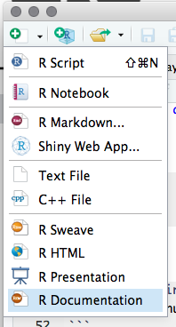
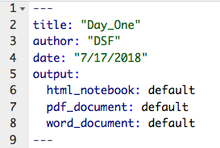
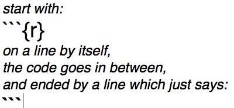
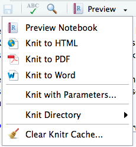
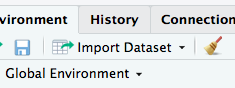
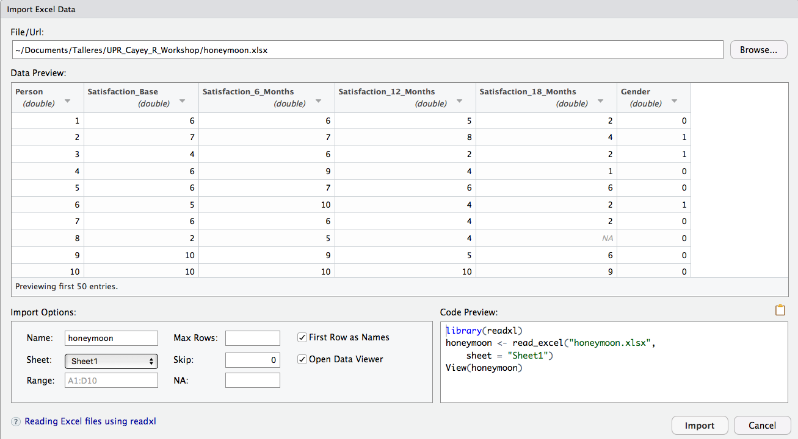

## R 
R is an open-source programming environment, for statistical computing and data visualization, among other capabilities.

__R has many features to recommend it (Kabacoff, 2015):__  

* Most commercial statistical software platforms cost thousands, if not tens of thousands, of dollars. __R is free!__ If you’re a teacher or a student, the benefits are obvious.

* R is a comprehensive statistical platform, offering all manner of data-analytic techniques. Just about __any type of data analysis can be done in R.__  

* R contains __advanced statistical routines__ not yet available in other packages. In fact, new methods become available for download on a weekly basis. 

* R has __state-of-the-art graphics capabilities__. If you want to visualize complex data, R has the most comprehensive and powerful feature set available.  

* R is a powerful platform for __interactive data analysis and exploration__. For example, the results of any analytic step can easily be saved, manipulated, and used as input for additional analyses.  

* Getting data into a usable form from multiple sources can be a challenging proposition. R can easily __import data from a wide variety of sources__, including text files, database-management systems, statistical packages, and specialized data stores. It can write data out to these systems as well. R can also access data directly from web pages, social media sites, and a wide range of online data services.  

* R provides an unparalleled __platform for programming__ new statistical methods in an easy, straightforward manner. It’s easily extensible and provides a natural language for quickly programming recently published methods.  

* R functionality __can be integrated into applications written in other languages__, including C++, Java, Python, PHP, Pentaho, SAS, and SPSS. This allows you to continue working in a language that you may be familiar with, while adding R’s capabilities to your applications.  

* R __runs on a wide array of platforms__, including Windows, Unix, and Mac OS X. It’s likely to run on any computer you may have.  If you don’t want to learn a new language, a variety of graphic user interfaces (GUIs) are available, offering the power of R through menus and dialogs.

#####__where to look in the book?__:
__chapter 1__

***

## RStudio
Programming, editing, project management, and other procedures in R, are more easy and efficient using an integrated development environment (IDE), and the most used and versatile is [RStudio](https://www.cs.utexas.edu/~cannata/dataVis/Class%20Notes/Getting%20Started%20with%20RStudio.pdf).

####_Exercises_
__Open RStudio:__  

+  browse all the components of the interface  
+  establish a Working Directory  
+  create a __R Script__ (compare with the R console)
  


+  write code to calculate the area of a geometric surface, and run it  
+  explore other windows and menus of RStudio  
+  load packages

#####__where to look in the book?__:
__chapter 2 & 3 __

***

## R Markdown (or [R Notebook](https://bookdown.org/yihui/rmarkdown/notebook.html#using-notebooks))
As important as carrying out the data analysis of an investigation (main objective of this workshop), it is also important to communicate the results to an audience, and receive acknowledgement and comments about them. Usually that aspect is addressed at the end (as in the workshop book: Chapter 28), but if we do so, we can leave behind notes, results, graphs, et c., which at some point we have to find, organize and move to a final document. 

### Creating a R Markdown document
First, check if you have the package __rmarkdown__ installed; for this, look into the __Packages__ menu (User Library).

To create a R Markdown document, use the left-upper corner menu:

>{#id .class width=100px}\

Select __R Markdown__.

### Editing the document
The R Markdown has three types of content:

* an (optional) __YAML header__ surrounded by - - -
* R __code chunks__ surrounded by ```
* simple __text__ mixed with formatted text, images, tables

The YAML header is a metadata section of the document, and can be edited to include basic information of the document:

>{#id .class width=180 height=120px}\

You can change (or eliminate) the title, author, and date.  The output option is originally created by RStudio, and depends on the output format that you produce (html, pdf, Word).  A R Markdown document (html_document) can be transformed into a R Notebook (html_notebook) and _vice versa_. 

The text and other document features (web links, images, tables) are edited or created using a [R Markdown syntax](https://drive.google.com/open?id=1M2sswt7_dMUqvI9Dx9e_DiGHwKaKgNAe).

### Inserting R code chunks
A [code chunk](https://rmarkdown.rstudio.com/lesson-3.html) is simply a piece of R code by itself, embedded in a R Markdown document. The format is:

>{#id.class width=180px height=120px}\

Inside the {r} you can write [chunk options](https://bookdown.org/yihui/rmarkdown/r-code.html) that control the behavior of the code output, when producing the final document.

Another way to create code chunks (including for other scripting languages) and select options, is using the  drop-menu.

### Executing code chunks and controling output 
1. [Code in the notebook can be executed](https://bookdown.org/yihui/rmarkdown/notebook.html#using-notebooks) in different ways:
Use the green triangle button on the toolbar of a code chunk that has the tool tip “Run Current Chunk”, or Ctrl + Shift + Enter (macOS: Cmd + Shift + Enter) to run the current chunk, or use "Run Selected Line(s)", for one or more selected lines of code.

2. Press Ctrl + Enter (macOS: Cmd + Enter) to run just the current statement.

3. There are other ways to run a batch of chunks if you click the menu Run on the editor toolbar, such as "Run All", "Run All Chunks Above", and "Run All Chunks Below".

In the previous section you can find how to control chunk output, with several options, but you can also select the options using .

### Using Knit to produce a HTML or Word document
Now you can produce a HTML or Word document (this is called knitting, [Knit](https://rmarkdown.rstudio.com/lesson-9.html)), using the following menu: 

>{#id .class width=180 height=120px}\

Producing a PDF document requires a _LaTex_ version for your computer (usually requires more than 1 GB!).

### Extras
[TinyTex](https://yihui.name/tinytex/)  
[RPubs](http://rpubs.com/)

#####__where to look in the book?__:
__chapters 27 & 28__

***

## Basic operations and variable types

1. Open a new R Markdown, and name it _"Apuntes del Taller R"_.
2. Save it with a short name.
3. Edit the YAML metadata information, including a new title, your name and date.
4. Write a title for a section called: "Ejercicios Introductorios".  In this section we are going to practice some common R operations and variable types.
5. Create a chunk.
6. Using __#__ write titles and short descriptions inside the chunk.

### Mathematical operations and variable assignment

```{r math}
#basic math operations
56 + 45
56/45
#order of operations and parentheses
6 + 5 * 9
(6 + 5) * 9
5 + 3 / 2 * 3
5 + 3 / (2 * 3)
#variable assignment
#you can use <- or = , but the first is more used
v1 <- 2.5
v1
long <- v1
width <- 1.25
area <- long * width
long
width
area
```

### Data types  
There are four basic data types in R:

+ __numeric__ (including _integer_, _double_)
+ __character__ (including "strings", _factor_)
+ __time__ (including _Date_ and _POSIXct_)
+ __logical__ (TRUE, FALSE)

#### numeric

```{r data.numeric}
# how to know if a variable contain a numeric data?
vari1 <- 14 / 2
vari1
class(vari1)
# a numeric data can be an integer
vari2 <- as.integer(14 / 2)
vari2
class(vari2)
# try 15/2
```

#### character

```{r data.character}
# characters must use " "
char1 <- "hola"
char1
class(char1)
# numeric to factor
char2 <- factor(3)
char2
class(char2)
# nchar output is the length of a character variable (or numeric treated as character)
nchar(char1)
nchar(12358)
# does it works with a factor?
```

#### Date and Time of the day
Using __as.Date__ store a date string ("year-month-day") as a Date type data; it can be converted to numeric (__as.numeric__), counting days since January 1, 1970. With __as.POSIXct__ a string of date and time of the day ("year-month-day hour:minute:second") is converted to a time (POSIXct) class data; numerically is the number of seconds 
```{r data.time}
# as.Date store a date string as Date data
today <- as.Date("2019-10-26")
today
class(today)
# number of days since January 1, 1970
today.days <- as.numeric(today)
today.days
class(today.days)
# date and time
today.time <- as.POSIXct("2019-10-26 09:00")
today.time
class(today.time)
# how many seconds since January 1, 1970?
```

#### logical
A variable can store logical data (__TRUE__ or __FALSE__), as result of a logical statement.
```{r data.logical}
# does a equal/no equal b?
a <- 23 + 2/3
b <- 25 - 2/3
equal <- a == b
equal
class(equal)
noequal <- a != b
noequal
# comparing characters, logical results depend on alphanumeric order
char <- "2data" > "data2"
char
# what is the result: equal*5 - noequal*5 ? Why?
```

#####__where to look in the book?__:
__chapter 4__

***

## Datasets
The first step in any data analysis is the creation of a __dataset__ containing the data to be analyzed, in a format that meets your needs. In R, this task involves the following:

* Selecting a data structure to hold your data
* Entering or importing your data into the data structure

### Data structures
R has a wide variety of objects for holding data, including scalars, vectors, matrices, arrays, data frames, and lists. They differ in terms of the type of data they can hold, how they are created, their structural complexity, and the notation used to identify and access individual elements.

__R data structures:__

* _vector_
* _matrix_
* _data frame_
* _array_
* _list_

#### Vectors
Vectors are one-dimensional arrays that can hold numeric data, character data, or logical data. The combine function: __c(...)__ is used to form the vector.
```{r vectors}
# numeric data
vec.num <- c(1, 2, 5, 3, 6, -2, 2.3)
vec.num
# character data
vec.char <- c("one", "two", "three")
vec.char
# What happen if we combine different types of data?
##
# vectors can be created with numeric and logic operators:
vec.oper <- c(2/5, 3, 5+3, 4-7, 4 == 4.01, 3.5 < 3.5001, "data" < "2data")
vec.oper
# vectors can be created with the content of variables:
vec.var <- c(equal, a, b, today.days)
vec.var
# the function seq(...) can be used to create vectors:
vec.seq <- seq(3, 4.5, 0.2) # c(...) is not necessary
vec.seq
```

You can refer to elements of a vector using a numeric vector of positions within brackets. 
```{r vector.ref}
# vector created from simple sequence
vec.ref <- c(3:11)
vec.ref
# locate the first three elements and last two elements
# first we need the length of the vector:
length(vec.ref)
# now we can look for the elements:
vec.ref[c(1:3, 8, 9)]
# another way:
vec.ref[-(4:7)]
```

We can do operations with vectors.
```{r vector.oper}
# multiplying two vectors
f <- c(1, 2, 3, 5, 7)
g <- c(2, 4, 6, 8, 10)
vec.mult <- f * g
vec.mult
# What happen if vectors are of different length?
```

#####__where to look in the book?__:
__chapter 4 __

***

#### Matrices
A matrix is a two-dimensional array in which each element has the same class (numeric, character, or logical). Matrices are created with the __matrix(...)__ function. The general format is:

>| mymatrix <- matrix(_vector_,
|       nrow=_number of rows_,
|       ncol=_number of columns_,
|       byrow=_logical value_,
|       dimnames=list(_character vector of row names_, _character vector of column names_)
|       )

```{r matrix}
# data vector - [age,glu,chol]
vec.diabetes <- c(32,90,160,26,130,200,40,200,180,55,150,260)
# name vectors
RowN <- c("patient 1","patient 2","patient 3","patient 4")
ColN <- c("Age","Glucose","Cholesterol")
# matrix
mtx.diabetes <- matrix(vec.diabetes,
                       ncol = 3,
                       byrow = TRUE,
                       dimnames = list(RowN,ColN)
                       )
mtx.diabetes
class(mtx.diabetes)
```
Data selection from a matrix, is similar as vectors, but now we must specify rows and columns.
```{r matrix.select}
# selecting all rows and two columns
new.matrix1 <- mtx.diabetes[ ,2:3]
new.matrix1
# selecting first and last patient, and age and cholesterol
new.matrix2 <- mtx.diabetes[c(1,4),c(1,3)]
new.matrix2
```

#### Data frames
A data frame is more general than a matrix in that different columns can contain different classes of data (numeric, character, and so on). Data frames are the most common data structure you will deal with in R.
A data frame is created with the __data.frame(...)__ function:

>mydata <- data.frame(col1, col2, col3,...)

where col1, col2, col3, and so on are column vectors of any type (such as character, numeric, or logical). 

```{r data.frame}
# column vectors
ID <- c(1L,2L,3L,4L)
chol <- c(160, 200, 180, 260)
glu <- c(90, 130, 200, 150)
age <- c(32,26,40,55)
sex <- c("M","F","M","M")
diabetes <- c("neg","pos","pos","neg")
# data frame from vectors
patientdata <- data.frame(ID, age, sex, glu, chol, diabetes)
class(patientdata)
patientdata
# changing the name of the columns
new.patiendata <- setNames(patientdata, c("Patient ID","Age","Birth Sex","Blood Glucose","Cholesterol","Diabetes Diagnosis"))
new.patiendata
```
Data selection from a data frame is similar to selection from a matrix, but also is possible to do logical selections using factor columns.
```{r select.data.frame}
# selecting columns by name
select.df1 <- new.patiendata[ ,c("Blood Glucose","Diabetes Diagnosis")]
select.df1
# selecting using logical operator
select.df2 <- new.patiendata[new.patiendata$`Diabetes Diagnosis`=="pos",]
select.df2
```

#####__where to look in the book?__:
__chapter 5__

***

## Data input
R provides a wide range of tools for importing data, and create data frames. The definitive guide for importing data in R is the R Data Import/Export manual available at http://mng.bz/urwn.  
We are considering three tools to input data for analyses:

+ __manually__: as we did before with the matrix and data frame examples.
+ __reading text__ file with comma separated values (read.csv)
+ __import Excel files__ using the {#id .class width=100 height=60px} menu, in the Environment tab (usually upper-right component of RStudio)

### Reading CSV files
CSV files are text files where values in each line are separated by commas (i.e. 1,2,3,5,7,11), and have a carriage return code at the end of each line.  The file can be created with any text editor or exported from a spreadsheet application (Excel, for example).  To read a CSV file use the following basic code:
```{r read.csv}
honeymoondata <- read.csv('honeymoon.csv', header = TRUE)
dim(honeymoondata)
head(honeymoondata)
class(honeymoondata)
```

### Import data from Excel file
RStudio provides a menu driven tool to import data from an Excel file (and other types, too).  It requires that you have installed and activate the __readxl__ package.  Use the menu __Import Dataset__, select the _File_, select the _Sheet_ with the data you are interested in, and check _First Row as Names_ if that is the case.

{#id .class width=500 height=320px}\

These menu actions will generate a code that you can use inside your procedure.

```{r read.excel}
library(readxl)
melodata <- read_excel("melocactus.xlsx", 
    sheet = "datos")
class(melodata)
head(melodata)
tail(melodata)
```

#####__where to look in the book?__:
__chapter 6 __

***

## Descriptive Statistics
R has a large number of ways to calculate descriptive statistics on the datasets, some are included in the basic installation, and others in packages that need download-installation (using __install.packages(...)__ or the __Package__ menu) and load (activation) to the R environment (using __library(...)__).

### Using __summary__
__summary__ is the simplest way to obtain some descriptive statistics from our data.
```{r stats.summary}
# select the columns (variable) to analyze
melovars <- c("alturatotal","longinflo")
# use summary
summary(melodata[melovars])
```

### Using __sapply__ and a __function__
A more general way to calculate descriptive statistics is using the __sapply__ procedure, with the syntax:

>sapply(x, FUN, options))

where _FUN_ is a simple system function (like mean(_var_), sd(_var_), et c.) or an user-defined __function__, with the following syntax:

>myfunction <- function(arg1, arg2, ... ){\
statements\
return(object)\
}

```{r stat.sapply}
# defining function
mystats <- function(x){
                m <- mean(x)
                md <- median(x)
                n <- length(x)
                s <- sd(x)
                return(c(n=n, mean=m, median=md, stdev=s))
}
# sapply function on dataset
sapply(melodata[melovars], mystats)
```
We can select some of the data to apply the statistics.
```{r select.sapply}
# select plants with longitude of inflorescence different from 0
melo.inflo <- melodata[melodata$longinflo > 0,"longinflo"]
# sapply function mystats
sapply(melo.inflo, mystats)
```

### Using aggregate
When you have variables that can be considered as factor, you can use the __aggregate__ function to obtain basic statistics aggregating by such factors.  The function has the following syntax:

>aggregate(x, by, FUN)

```{r}
# calculate the mean of plant heights (alturatotal) by plant status (estado)
aggdata <- aggregate(melodata$alturatotal, by = list(melodata$estado), mean)
aggdata
# we can change the names of columns
aggdata <- setNames(aggdata, c("Plant Status","Mean Height, cm"))
aggdata
```

***

### Using a data.table
The __data.table__ package allows for an improved functionality of data.frames operations. First, we have to convert a data.frame into a data.table. Thereafter you can select subgroups and apply functions to them.
```{r datatable}
# activate data.table package
library(data.table)
# conver data.frame o data.table
melodataDT <- data.table(melodata)
class(melodataDT)
# descriptive statistics by groups
meloDS <- melodataDT[, list(Media=mean(alturatotal), Median=median(alturatotal), StDev=sd(alturatotal)), by=list(Status=estado)]
meloDS
# ordering results
meloDS[order(Media)]
```

#####where to look in the book?
__chapters 11, 18__

***

## Introduction to graphs
R is a great platform for _building_ graphs. Literally, in a typical interactive session, you build a graph one statement at a time, adding features, until you have what you want.  
The __base graphics__ system of R is described at the beginning of __chapter 7__ in the Lander's book.  Two other systems, that are widely used, and provide extensive options are [__lattice__](www.statmethods.net/RiA/lattice.pdf) and [__ggplot2__](https://ggplot2.tidyverse.org/reference/).  We will be mostly using the base graphics system and ggplot2.

### The primary graph for a variable: the histogram
Histograms display the distribution of a continuous variable by dividing the range of scores into a specified number of bins on the x-axis and displaying the frequency of scores in each bin on the y-axis. 

#### Introducing ggplot2: building a histogram
Now we are going to build a histogram using ggplot2.  [ggplot2](https://ggplot2.tidyverse.org/reference/) provides a system for creating graphs based on the grammar of graphics. The intention of the ggplot2 package is to provide a comprehensive, grammar-based system for generating graphs in a unified and coherent manner, allowing users to create new and innovative data visualizations. The power of this approach has led ggplot2 to become an important tool for visualizing data using R.

First, let see a basic ggplot2 histogram:

```{r histo}
# activating ggplot2
library(ggplot2)
# basic histogram
ggplot(melodata, aes(alturatotal))+
  geom_histogram(color="white", bins = 14)
```
Now a more detailed histogram, including several _layers_:

```{r histoplus}
hist.melodata <- ggplot(melodata, aes(alturatotal)) + 
  geom_histogram(aes(y=..density..), bins = 14, colour="white", fill="green") +
  geom_rug(sides = "t", color = "black") +
  labs(x="Total heigth,cm", y = "Density") +
  stat_function(fun = dnorm, 
                args = list(mean = mean(melodata$alturatotal, na.rm = TRUE), 
                            sd = sd(melodata$alturatotal, na.rm = TRUE)), 
                colour = "red", size = 1)
hist.melodata
```

### The popular graph: bars with errors
Descriptive statistics are usually graph using bars (for the means), and up and down lines for some measure of deviation or error (standard deviation, standard error, or confidence interval).
```{r}
# summarySE provides the standard deviation, standard error of the mean, and a (default 95%) confidence interval
library(ggplot2)
library(Rmisc)
# statistics for the bars&errors graph
melo.bars <- summarySE(melodata, measurevar="alturatotal", groupvars="estado")
melo.bars
# Error bars represent standard error of the mean
ggplot(melo.bars, aes(x=estado, y=alturatotal)) +
  geom_bar(position=position_dodge(), stat="identity", fill="cornflowerblue",
           width=0.5) +
  geom_errorbar(aes(ymin=alturatotal-se, ymax=alturatotal+se),
                  width=.2,  # Width of the error bars
                  position=position_dodge(.9)) +
  scale_x_discrete("Plant Condition") +
  scale_y_continuous("Plant Heigth, cm")
```

#####where to look in the book?
__chapter 7__

***

## _Homework_
Here is an assigment to complete, and send me for review.

+ Look in your kitchen, fridge, or elsewhere, for food with nutrition labels (Nutrition Facts).
+ Find ten canned (sealed) foods, ten in boxes or bags (dry food), and ten beverages or creamy (liquids).
+ For each item, take note of the values for calories per serving, serving size (g), total fat (g), cholesterol (mg), sodium (mg), total carbohydrates (g), and protein (g), for each food.
+ Create an Excel workbook with the data, using the template: [Template for Food Data](https://drive.google.com/open?id=1AXlCx-_zgPfmUB0YVC0Zi4ZFJtWspcmp)


## References

Kabacoff, R., 2015. R in action: data analysis and graphics with R, Second edition. ed. Manning, Shelter Island.

Lander, J. P., 2014.R for everyone. Pearson Education, Inc., Upper Saddle River, NJ, USA.

Verzani, J., 2012. [Getting started with RStudio](https://www.cs.utexas.edu/~cannata/dataVis/Class%20Notes/Getting%20Started%20with%20RStudio.pdf). O’Reilly, Sebastopol, Calif.

Xie, Y., J. J. Allaire, G. Grolemund, 2018. [R Markdown: The Definitive Guide](https://bookdown.org/yihui/rmarkdown/). Chapman & Hall/CRC.


